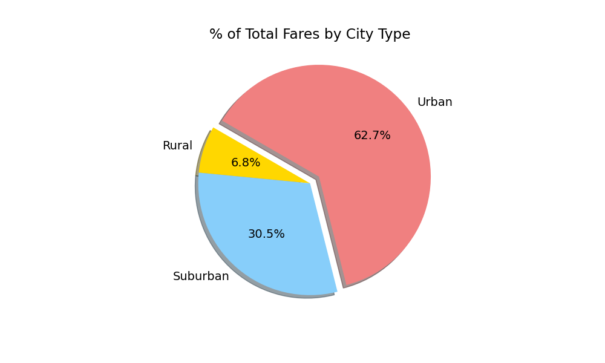
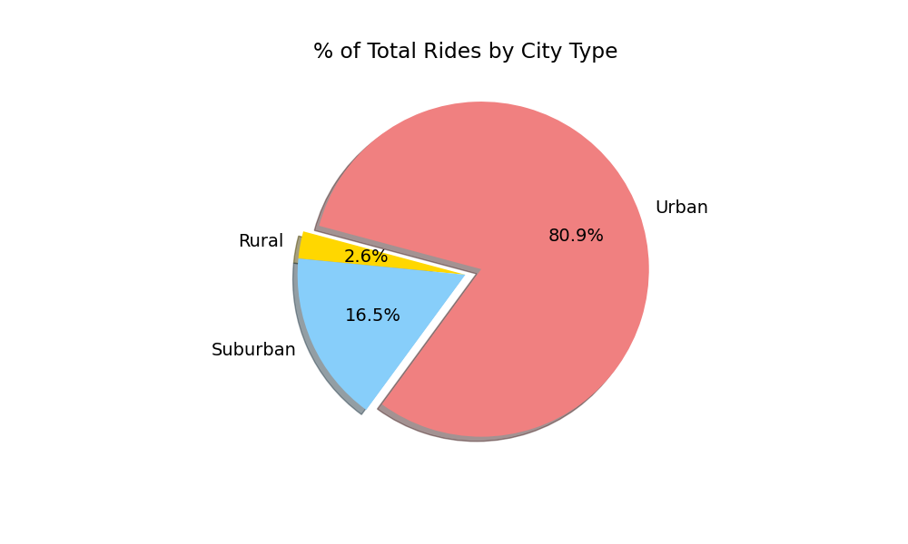
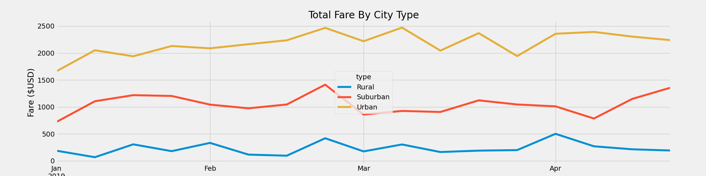

# Pyber_Analysis

## Overview of the analysis

We reviewed three different city types (Urban, Suburban, and Rural) for Pyber drivers.  We looked at the number of rides, number of drivers,
and their fare prices.  Once we had that we broke it down a bit more by reviewing a 4 month period in 2019 (January thur April) for all 
the three city types to review their total fares. During the initial analysis we can see that the rural drivers did make more in
their fares on average but they also didn't have as many drivers there.  Our urban drivers though overall created the most fares
for Pyber.

## Results

Our results after reviewing the data shows that our urban drivers do collect the most fares for Pyber, as shown here in this pie
graph. The Urban driver gave us 62.7% of Pyber's fares.   

Interesting enough though; even though the Rural accounted for only 6.8% of the total fares they only accounted for 2.6% of
the total rides.  Showing that although our Rural areas do less rides as to be expected they are profitable.  

We then did the quick review of those four months in 2019 (January-April) and it showed us that our Urban drivers were making 
over $2000 each week for us during this time and at times reaching as high as $2500.  During that same period the Suburban
drivers were able to be above $1000 for the most part with a couple times that it dipped below that.  The rural drivers typically
were around the $200-$300 range.  In the first three months all three types seemed to dip at the start of each month then increase 
by the end of the month. In the last week of February all three types peaked.  

## Summary

After reviewing the data we do have three recommendations for V. 

1. Due to the pie chart it seems that adding more Rural drivers may increase our fares if we can add more rides
2. The same can be said about our Suburban drivers, adding more drivers there can increase our fares
3. It also seems to be a good idea to review more why the start of months seems to be so slow.  Is it because we lack
enough drivers at the start of months? 
